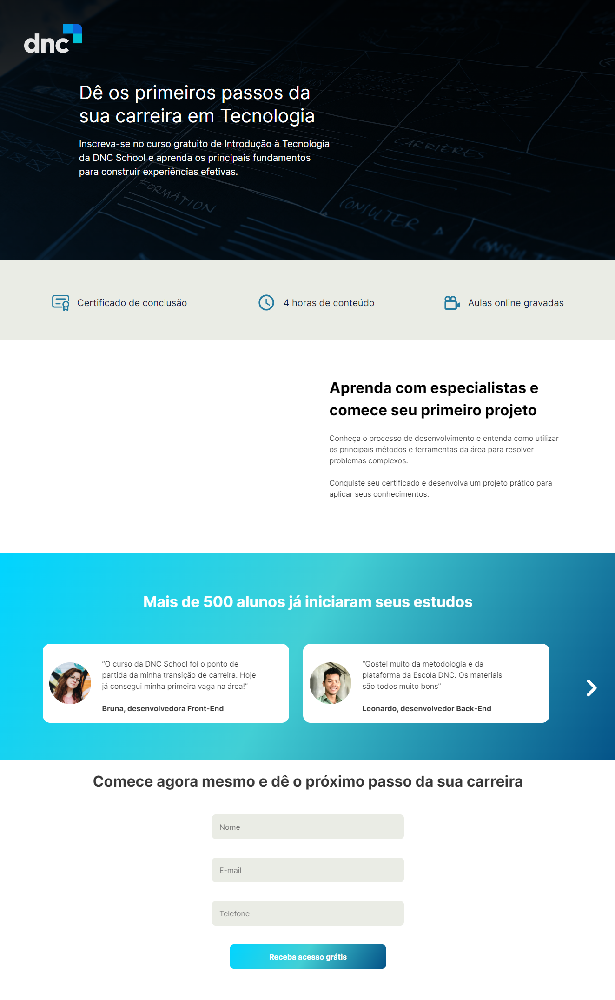

# Landing Page DNC School

## Escola DNC Ciclo Base
## Recriando Layout

> Formação em Tecnologia

Projeto construido atraves do Layout criado em aula.

 [🔗 Clique aqui para acessar](https://sebastiao-vitor.github.io/Projeto-LandingPage-Escola-DNC/)

## 🧰🛠️ Tecnologias

- HTML
- CSS
- Git e Github
- Grid
- Animação
- Variavéis
- WEB
- FIGMA
- FlexBox
- Fontes e personalizção
- Trasição e tranformação
- Formularios
- MonkShets
- Linear-gradient
- Function
- JavaScript
- DOM basic

## 💛 Contato

sebastiaovitor18@gmail.com

[Linkedin](https://www.linkedin.com/in/sebastião-vitor-7a2870106/)
=======

Projeto feito em aula com a ajuda do prof. Juan, onde foram abordados vários conhecimentos base para se construir uma landing page de sucesso para nosso portfólio. 😄👾
Gostei muito do projeto e aprendi vários conceitos e tecnicas para melhor uso da linguagem.
Dei algumas alterações na page para brincar um pouco com o conteúdo e testar as minhas habilidades.

Ansioso para as próximas etapas.
😁bora codar.